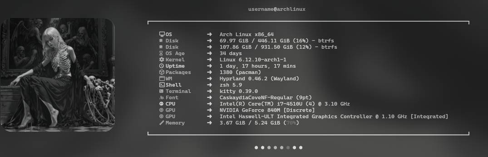

# Fastfetch

# Zsh prompt

## Zsh keymaps
- Ctrl+R - Search for a command in history using fzf.
- Alt+C - Search and go to directory using fzf.
- Ctrl+t - Find a file or directory using fzf with the ability to delete, open in editor, and open with sudoedit. [See.](fzf.zsh)

## Zsh submodules
- [fzf-tab](https://github.com/Aloxaf/fzf-tab)
- [zsh-autosuggestions](https://github.com/zsh-users/zsh-autosuggestions)
- [zsh-fzf-history-search](https://github.com/joshskidmore/zsh-fzf-history-search)
- [zsh-syntax-highlighting.git](https://github.com/zsh-users/zsh-syntax-highlighting.git)
